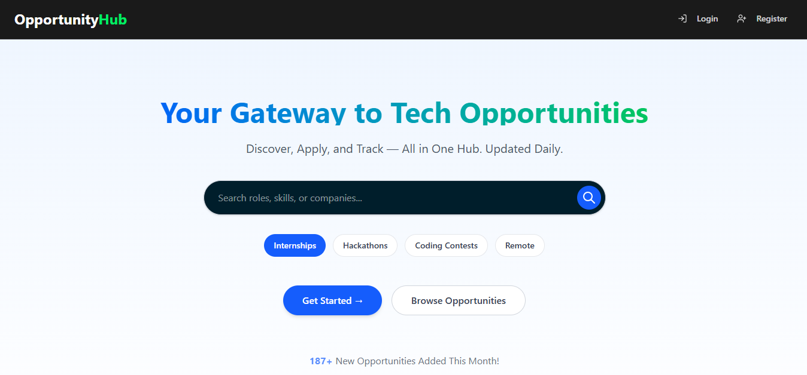
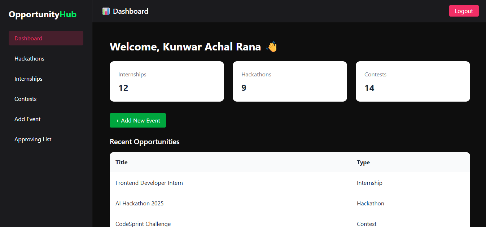
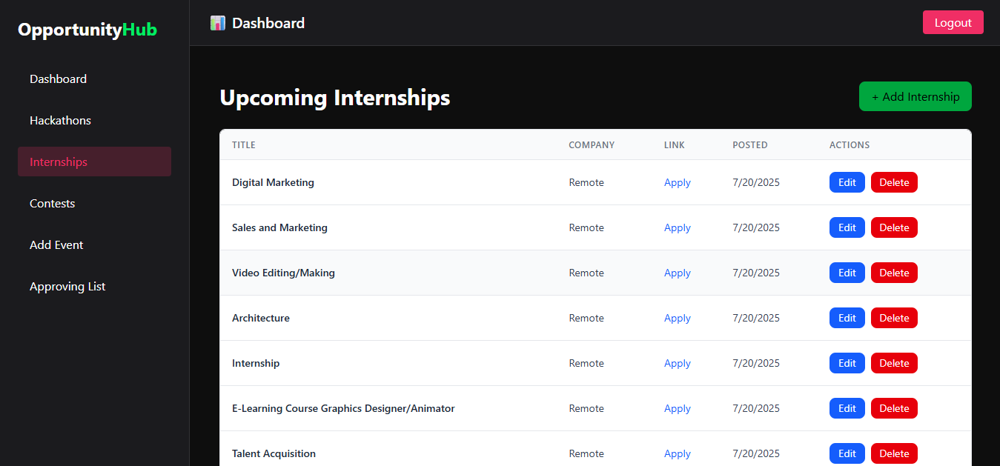
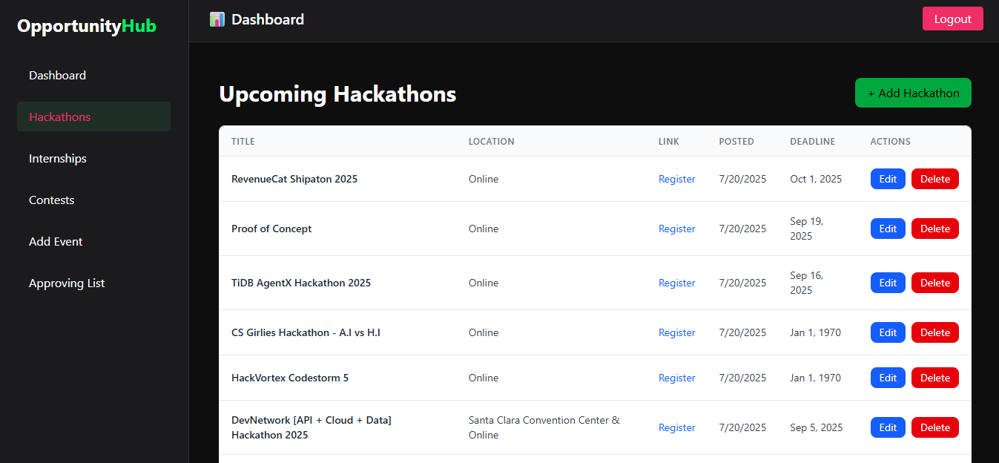

# 💼 Opportunity Hub

A full‑stack web application to efficiently discover, manage, and track internships, jobs, and hackathon opportunities — all in one place.


## 🔗 Live Demo

Check out the live project: [https://opportunity-hub-nine.vercel.app/](https://opportunity-hub-nine.vercel.app/)

GitHub Repository: [https://github.com/Amandeep732/Opportunity-Hub](https://github.com/Amandeep732/Opportunity-Hub)


## ✨ Features

🔎 **Advanced Opportunity Search**
Filter and search opportunities by role, company, location, or application status with lightning speed.

📅 **Application Timeline**
Visualize each application’s journey with a clear timeline of events (applied, interview, offer, etc.).

🔔 **Smart Notifications**
Get instant alerts for status changes, upcoming deadlines, or newly scraped opportunities.

🤝 **Company Insights**
View aggregated details about companies — average response time, number of openings, and hiring trends.


🛠 **Admin Tools for Moderation**
Built‑in tools to manage users, verify listings, or handle flagged content.

🌍 **Multi‑Platform Data Integration**
Aggregate internships, hackathons, and jobs from multiple portals using Puppeteer + Cheerio scrapers.


📈 **Analytics & Progress Tracking**
View graphs for applications per month, offer rates, and interview conversion.

🛡 **Robust Security**
Secure API routes, rate limiting, and sanitized input for safe handling of user data.


## 📸 Screenshots






## 🛠️ Tech Stack

- Next.js 15 (App Router)
- Tailwind CSS
- MongoDB (Mongoose)
- JWT Authentication
- Vercel (Hosting)

## 📦 Getting Started

1. Clone the repo

```bash
git clone https://github.com/Amandeep732/Opportunity-Hub
cd opportunity-hub

npm install


## 📦 .env
MONGODB_URI=your mongodb
JWT_ACCESS_EXPIRY=your access expiry
JWT_REFRESH_SECRET=your refresh expriy
JWT_REFRESH_EXPIRY=your refresh expiry
UPSTASH_REDIS_REST_URL=your redish URL
UPSTASH_REDIS_REST_TOKEN=your token
RESEND_API_KEY=your resend api key

npm run dev


## 👨‍💻 Author

- **Achal Tanwar**
- GitHub: [profile](https://github.com/Amandeep732)

